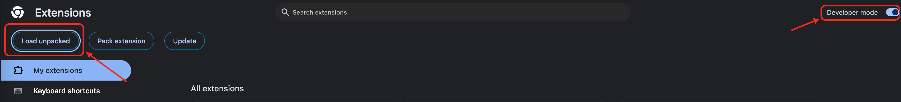
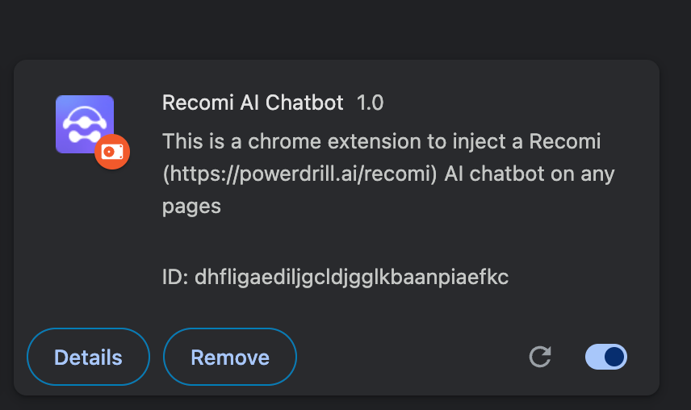
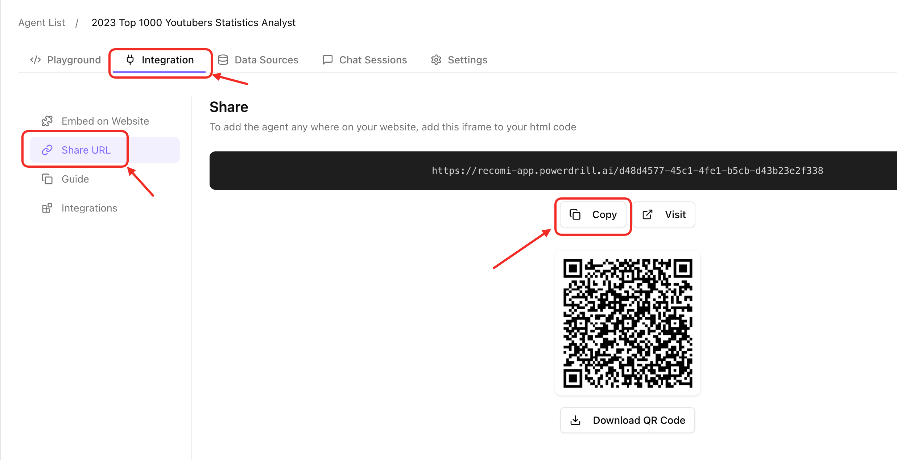
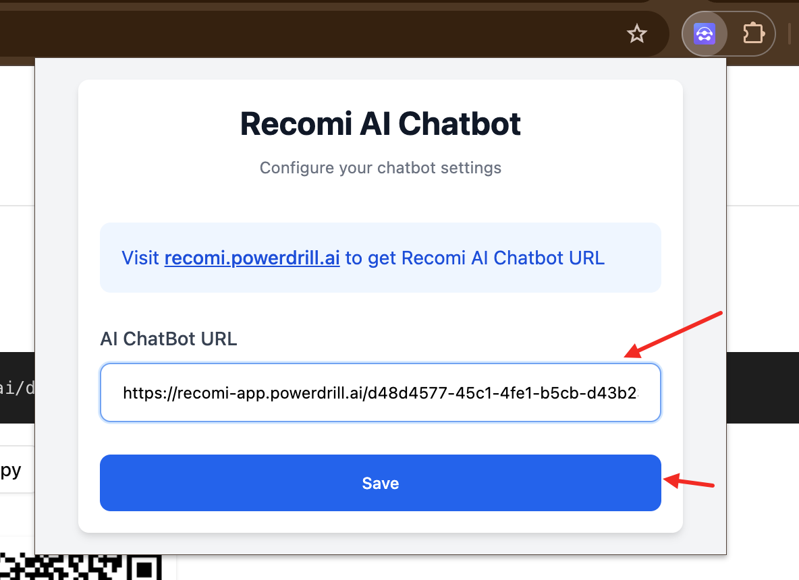
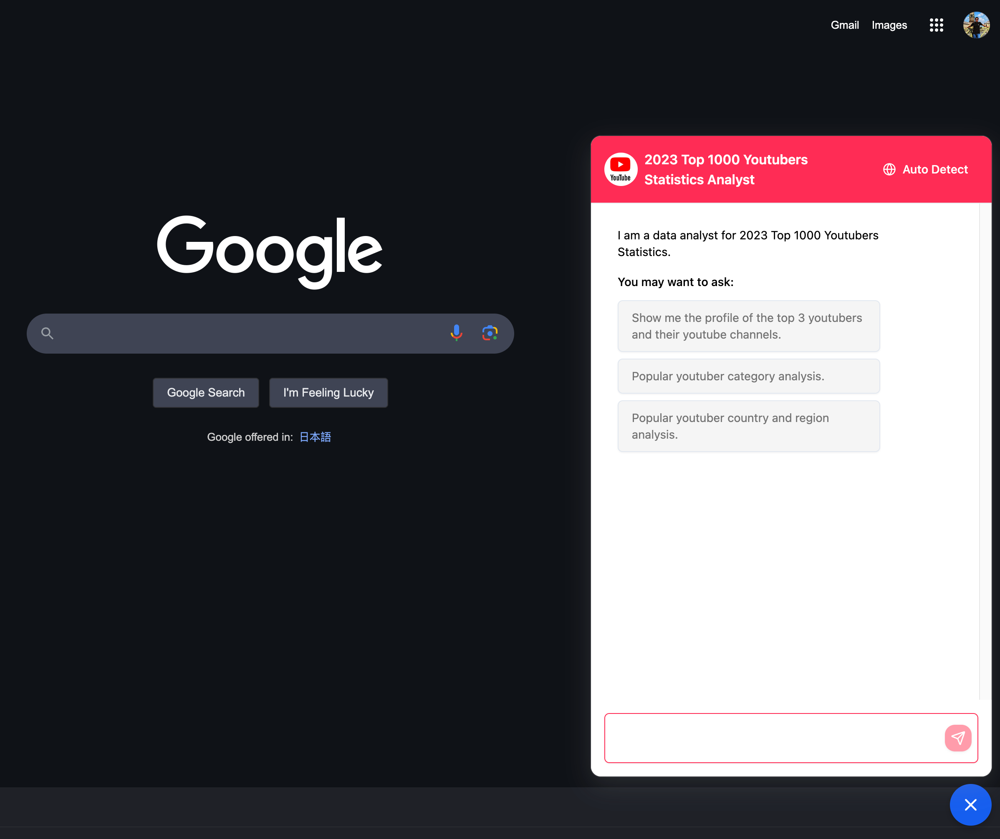

## Chrome Extension for Recomi AI Chatbot

### Method 1: Chrome Extension Store

* [Coming soon ...]() *

### Method 2: Load in Developer Mode Locally

- Go to Chrome browser extension management, you can directly access [chrome://extensions/](chrome://extensions/)
- Enable **Developer mode** and click **Load unpacked extension**

- Then open the root directory of the extension source file
    - third-party
        - chrome plug-in
            - content.js          Floating button JS script
            - favicon.png         Extension icon
            - manifest.json       Extension description file
            - options.css         Extension configuration page style file
            - options.html        Extension configuration static HTML page
            - options.js          Extension configuration JS script

The following image shows that the extension has been loaded successfully.

Then you can open the extension as shown below:

### After importing the extension, subsequent configurations are the same
- Create or find your Recomi AI Agent, go to the Agent page -> **Integration** -> **Share URL**, click the **Copy** button to get the ChatBot URL, as shown in the figure

- Paste the Recomi AI chatbot URL and click "Save" and confirm the prompt to successfully configure

- Restart the browser to ensure that all pages are refreshed successfully
- Recomi AI chatbot floating bar can be loaded normally on any page in Chrome, if you need to change the chatbot, just change the ChatBot URL

## About Recomi

[Recomi](https://powerdrill.ai/recomi) is a comprehensive platform that enables you to create and deploy AI agents that enhance customer support and drive business growth. With support for 17 languages and versatile file handling capabilities, Recomi transforms your business data into interactive, intelligent conversations.